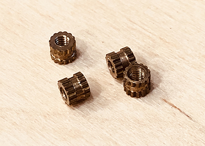

# Assembly & Installation

## Required Components

For the most basic setup, that only tracks internal temp, humidity, and activity, you'll need:

| Component | Description | Image |
|-----------|-------------|-------|
| **[Langstroth Hive](https://en.wikipedia.org/wiki/Langstroth_hive)** | Modern standard beekeeping hive design. You may be able to fit the enclosure in other hives, but it was designed to fit a standard Langstroth frame. | |
| **Meadow Apiarium Core Enclosure** | Mounts in a hive frame and contains the core electronics. | |
| **Core Meadow Controller and Components** | The main components that run the whole thing. | |
| **Solar Panel** | Used to power the system and charge the battery. | |

### Meadow Apiarium Core Enclosure

The Apiarium core enclosure mounts to a Langstroth frame of any height and contains the main Meadow controller, internal sensors, battery, and connectors for external sensors.

It can be printed on nearly any 3D printer, but we recommend printing it in wood PLA, as bees tend to prefer wood over plastic.

The enclosure has two parts, the main enclosure bottom, and a lid:

| Component | Image |
|-----------|-------|
| [Enclosure_Bottom.stl](/Design/Industrial_Design/Printable_Parts/Enclosure_Bottom.stl) | |
| [Enclosure_Top.stl](/Design/Industrial_Design/Printable_Parts/Enclosure_Top.stl) | |

Additionally, you'll need the following supporting hardware assemble and mount it:

| Component | Description | Image |
|-----------|-------------|-------|
| (4) M2 heat-set inserts | Provides structural integrity for lid attachment. |  |
| (8) M2 x 4mm socket head bolts | Attaches Meadow and Lid to box. |  |
| (2) Wood screws (what size?) | Attaches enclosure to frame. |  |

### Core Meadow Controller and Components

| Component | Description | Image |
|-----------|-------------|-------|
| **[Meadow F7 Dev Board](https://store.wildernesslabs.co/collections/frontpage/products/meadow-f7)** | | |
| **Meadow Expansion FeatherWing Board** | Provides a permanent platform for attaching components to Meadow. | |
| **Si7021 Temp & Humidity Sensor [SparkFun](https://www.sparkfun.com/products/13763), [Adafruit](https://www.adafruit.com/product/3251)** | I2C temp and humidity sensor. | |
| Breakaway Header | For attaching the Si7021 to the expansion board. | |
| [`3.7V`, `4400mAh` LiIon Battery](https://www.adafruit.com/product/354) | |
| Microphone (which?) | Measures beehive activity via sound. | |

## Optional Components

### Scale

| Component | Description | Image |
|-----------|-------------|-------|
| Quality scale | | |
| Wheatstone Bridge | | |

# Installation

[Recommend that you assembly everything and get it validated working before installation]